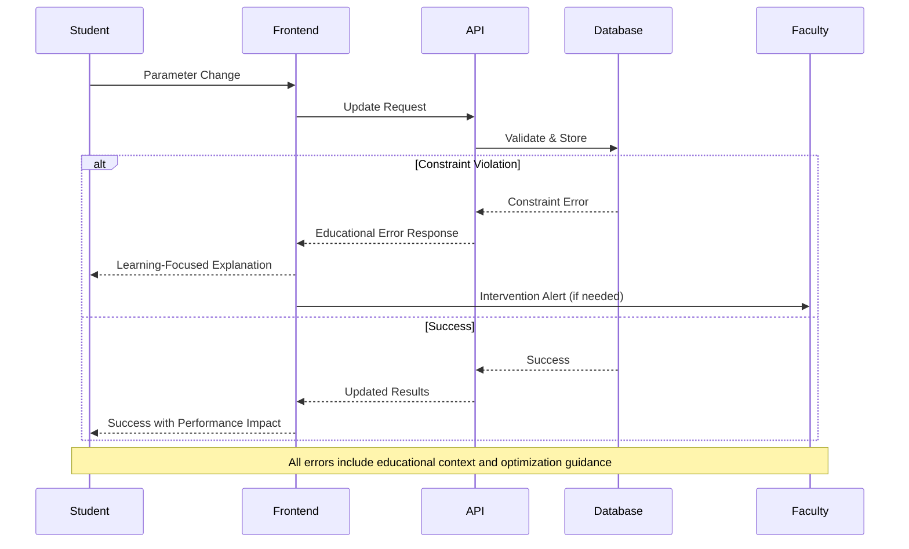

# Error Handling Strategy

Define unified error handling across frontend and backend with educational context and academic compliance.

## Error Flow



## Academic Error Response Format

```typescript
interface AcademicApiError {
  error: {
    code: string;
    category: 'constraint_violation' | 'calculation_error' | 'collaboration_conflict' | 'academic_integrity';
    message: string;
    student_explanation: string;
    educational_guidance: {
      concept: string;
      optimization_strategy: string;
      learning_resources: string[];
      suggested_next_steps: string[];
    };
    faculty_context?: string;
    recovery_options: RecoveryOption[];
    affects_academic_integrity: boolean;
    timestamp: string;
    session_id: string;
  };
}
```

## Frontend Error Handling

```typescript
export const handleAcademicError = (
  error: ApiError, 
  context: AcademicContext
): Promise<ErrorResolution> => {
  // Log for learning analytics
  auditLogger.logEducationalError(error, context);
  
  // Generate student-friendly explanation
  const educationalError = {
    displayMessage: generateStudentMessage(error),
    learningOpportunity: extractLearningConcept(error),
    optimizationGuidance: generateOptimizationAdvice(error),
    recoveryActions: getRecoveryOptions(error, context)
  };
  
  // Faculty notification for intervention triggers
  if (requiresFacultyIntervention(error, context)) {
    notifyFacultyForIntervention(error, context);
  }
  
  return showEducationalErrorDialog(educationalError, context);
};
```

## Backend Error Handling

```python
from app.core.exceptions import AcademicBaseException

class GMCConstraintViolation(AcademicBaseException):
    """Educational constraint violation with optimization guidance."""
    
    def __init__(
        self,
        constraint_type: str,
        violation_details: Dict[str, Any],
        academic_context: AcademicContext
    ):
        self.educational_response = {
            "student_explanation": self._generate_student_explanation(constraint_type),
            "gmc_concept": self._get_gmc_concept(constraint_type),
            "optimization_guidance": self._generate_optimization_advice(violation_details),
            "learning_resources": self._get_educational_resources(constraint_type),
            "recovery_suggestions": self._generate_recovery_options(violation_details)
        }
        
        super().__init__(
            message=f"GMC constraint violation: {constraint_type}",
            educational_context=self.educational_response,
            academic_context=academic_context
        )
```
